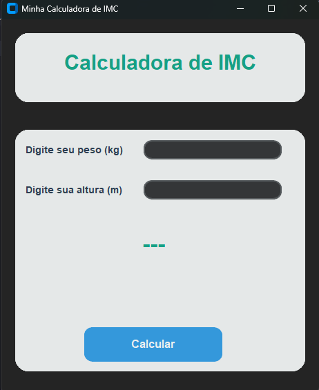
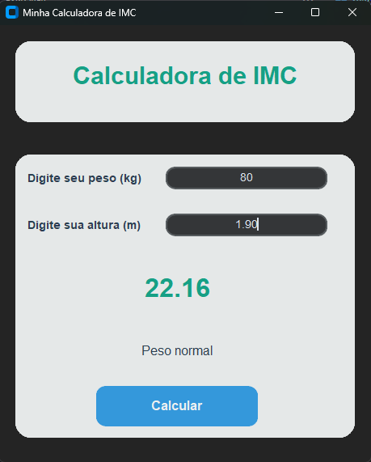

# 🏋️ Calculadora de IMC

<div align="center">


</div>

## 📝 Descrição

Uma calculadora de IMC (Índice de Massa Corporal) moderna e intuitiva, desenvolvida com Python e CustomTkinter. A aplicação oferece uma interface gráfica amigável para calcular o IMC e fornecer classificações de peso.

## ✨ Funcionalidades

- 🎯 Cálculo preciso do IMC
- 🎨 Interface moderna e amigável
- ✅ Validação de entrada de dados
- 📊 Classificação automática do resultado
- 🔄 Suporte para números decimais com vírgula ou ponto

## 🚀 Como Usar

1. Clone o repositório:
```bash
git clone https://github.com/adriel12319/CalculadoraIMC.git
```

2. Instale as dependências:
```bash
pip install customtkinter
```

3. Execute o programa:
```bash
python main.py
```

## 📊 Classificação do IMC

| IMC              | Classificação   |
|-----------------|-----------------|
| Menor que 18.5  | Abaixo do peso |
| 18.5 a 24.9     | Peso normal    |
| 25.0 a 29.9     | Sobrepeso      |
| 30.0 ou mais    | Obesidade      |

## 🛠️ Tecnologias Utilizadas

- Python 3.8+
- CustomTkinter
- Programação Orientada a Objetos

## 📸 Screenshots

<div align="center">
  
  
</div>

## 📄 Licença

Este projeto está sob a licença MIT. Veja o arquivo [LICENSE](LICENSE) para mais detalhes.

## 👤 Autor

Seu Nome
- GitHub: [@adriel12319](https://github.com/adriel12319)
- LinkedIn: [Adriel Araujo](https://linkedin.com/in/adrielsaraujo)

---

<div align="center">
Feito com ❤️ em Python
</div>